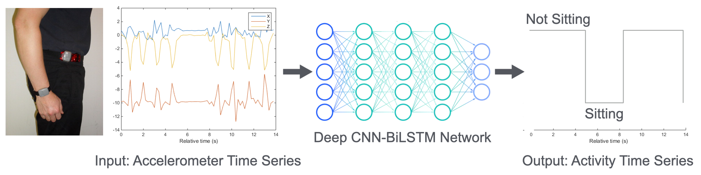

# DeepPostures
{: .fs-9 }

DeepPostures is a library containing deep learning methods for identifying human postures from hip-worn accelerometer data.
{: .fs-6 .fw-300 }

[Get started now]({{ site.baseurl }}){: .btn .btn-primary .fs-5 .mb-4 .mb-md-0 .mr-2 } [Watch Demos]({{ site.baseurl }}){: .btn .fs-5 .mb-4 .mb-md-0 } [View it on GitHub](https://github.com/ADALabUCSD/DeepPostures){: .btn .fs-5 .mb-4 .mb-md-0 }

---

📌 DeepPostures project is migrated to PyTorch. See the updated usage steps at [Getting Started]({{ site.baseurl }}).

## About 

Sedentary behavior (SB), especially in long uninterrupted bouts, is linked to all-cause mortality, cardiovascular disease (CVD), cancer, and type 2 diabetes outcomes. However, specific SB policy recommendations remain elusive due to ongoing debate about how to measure the quantity, domain, and temporal accumulation patterns of SB in relation to health outcomes. Wearable accelerometer sensors can collect data at fine granularity (e.g., 30Hz), making them useful for rich, nuanced SB assessment. Most studies quantify SB using energy-expenditure based cut-point calibration of hip- or wrist-worn accelerometers,  but this approach does not capture the postural component, i.e., sitting versus standing or moving, and in particular has poor accuracy for capturing postural changes. This leads to overestimation of breaks in sedentary time (i.e., transitioning out of a sedentary bout) and underestimation of sedentary bout durations. In this project we aimed to use deep learning methods to predict sitting versus non-sitting postures from raw triaxial accelerometer (i.e., Actigraph) time-series outputs, with the ultimate goal of improving measurement of sedentary (specifically sitting) time  and SB patterns, thereby obtaining more valid and precise estimates of associations between SB and health. 

## Acknowledgements

This work was supported by grant number R01DK114945 from the National Institute of Diabetes and Digestive and Kidney Diseases. It was also supported in part by a Hellman Fellowship, an NSF CAREER Award under award number 1942724, and gifts from VMware. 

## License

DeepPostures is distributed under [Apache License v2.0](https://github.com/ADALabUCSD/DeepPostures/blob/master/LICENSE).

<!-- ### Contributing

When contributing to this repository, please first discuss the change you wish to make via issue,
email, or any other method with the owners of this repository before making a change. Read more about becoming a contributor in [our GitHub repo](https://github.com/just-the-docs/just-the-docs#contributing).

#### Thank you to the contributors of Just the Docs!

<ul class="list-style-none">

  <li class="d-inline-block mr-1">
     
  </li>

</ul>

### Code of Conduct

Just the Docs is committed to fostering a welcoming community.

[View our Code of Conduct](https://github.com/just-the-docs/just-the-docs/tree/main/CODE_OF_CONDUCT.md) on our GitHub repository. -->
